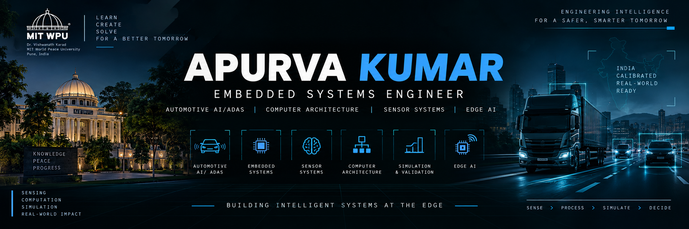

<div align="center">

<!-- Custom banner — banner.png lives at the repo root, this path is relative and renders straight from your repo. -->



<br/>

<!-- Portfolio link: swap to https://apurvakumar.me once the custom domain is verified -->
[](https://apurvakumar55.vercel.app/)
[](https://www.linkedin.com/in/apurvakumar55)
[](mailto:apurvak916@gmail.com)

</div>

<br/>

## `>_` about

Embedded Systems Engineer working across the hardware–software boundary — from sensors and firmware to simulation, computer architecture, and AI-driven systems.

Interested in systems where sensing, computation, and real-time decisions come together, particularly in automotive and edge-AI applications.

<br/>

<div align="center">


### >_ technology_stack

<div align="center">


</div>

**Embedded Systems**  
STM32 · ESP32 · Embedded C · STM32CubeMX · Keil · UART · SPI · I²C · Sensor Interfacing

**Automotive & ADAS**  
ADAS · ECU Diagnostics · Automotive Electronics · CAN · Real-Time Systems · Sensor Integration

**AI / Intelligent Systems**  
Machine Learning · Deep Learning · Neural Networks · Computer Vision · Scikit-learn · PyTorch · TensorFlow

**Simulation & Computer Architecture**  
CARLA · RoadRunner · gem5 · SPEC CPU2017 · Cache Analysis · Memory Hierarchy · Network-on-Chip

**Engineering Tools**  
MATLAB · Simulink · Docker · Git · GitHub · Jupyter Notebook · Cadence · AMD Vivado · Multisim

</div>

<br/>

## `>_` Selected Projects

<details>
<summary><b>AUTERA</b> — India-calibrated ADAS framework for heavy commercial vehicles</summary>
<br/>

India-calibrated ADAS framework for heavy commercial vehicles operating in heterogeneous urban traffic.

| | |
|---|---|
| **Target** | Heavy commercial vehicles |
| **Context** | India-calibrated traffic and road conditions |
| **Subsystems** | Perception, sensor fusion, validation pipeline |
| **Tags** | `ADAS` `Automotive` `Perception` `Sensor Fusion` `Simulation` |

**[→ View repository](https://github.com/Apurva-0210/Autera)**

</details>

<details>
<summary><b>AGNIS</b> — ESP32-based multi-gas sensing system</summary>
<br/>

ESP32-based multi-gas sensing system using MiCS-4514 and nanocomposite-functionalised sensing.

| | |
|---|---|
| **Platform** | ESP32-based data acquisition |
| **Sensor** | MiCS-4514 gas sensing |
| **Material** | Nanocomposite functionalisation |
| **Pipeline** | Sensing → acquisition → signal processing |
| **Tags** | `Embedded Systems` `Sensors` `ESP32` `Signal Processing` |

**[→ View repository](https://github.com/Apurva-0210/AGNIS-gas-sensing-project)**

</details>

<details>
<summary><b>gem5 — Memory & NoC Analysis</b></summary>
<br/>

Performance and architectural trade-off analysis using gem5.

| | |
|---|---|
| **Toolchain** | gem5 |
| **Evaluated** | Cache hierarchy, memory behaviour, Garnet NoC |
| **Analysis** | Performance and architectural trade-offs |
| **Tags** | `Computer Architecture` `Memory Systems` `NoC` |

**[→ View repository](https://github.com/Apurva-0210/Gem5-Memory-NoC-Analysis)**

</details>

<details>
<summary><b>ISDV-Net</b> — Intelligent Speed Detection & Vehicle Reasoning</summary>
<br/>

Attention-augmented deep learning framework for speed-sign detection and temporal reasoning.

| | |
|---|---|
| **Approach** | Attention-augmented deep learning |
| **Pipeline** | Speed-sign detection → temporal reasoning |
| **Objective** | Intelligent speed-awareness and vehicle decision support |
| **Tags** | `Deep Learning` `Computer Vision` `Traffic Systems` |

**[→ View repository](https://github.com/Apurva-0210/ISDV_NET)**

</details>

<details>
<summary><b>FleetEase</b> — Fleet & Vehicle Booking Management System</summary>
<br/>

DBMS project covering relational data modelling, SQL operations, and booking workflows.
`DBMS` `SQL` `Database Design`

**[→ View repository](https://github.com/Apurva-0210/FleetEase)**

</details>

<br/>

## `>_` open ~/portfolio

<div align="center">

<!-- Swap to https://apurvakumar.me once the custom domain is verified -->

### [apurvakumar55.vercel.app](https://apurvakumar55.vercel.app/)

Projects · Research · Experience · Resume · Contact

</div>

<br/>

## `>_` ps --current

```text
[ACTIVE]  Automotive perception & ADAS validation
[ACTIVE]  Embedded AI / edge intelligence
[ACTIVE]  Computer architecture & simulation
[ACTIVE]  Sensor-driven intelligent systems
```

<br/>

## `>_` cat /proc/stack

```text
LAYER 4  intelligent systems   Edge AI · Machine Learning · Deep Learning · Computer Vision
LAYER 3  automotive            ADAS · Sensor Fusion · ECU Diagnostics · CAN · Real-Time Systems
LAYER 2  simulation/architecture CARLA · RoadRunner · gem5 · SPEC CPU2017 · Memory Hierarchy · NoC
LAYER 1  embedded/firmware     STM32 · ESP32 · Arduino · Embedded C · Sensors · UART · SPI · I²C
LAYER 0  languages/tools        C · C++ · Python · MATLAB · Simulink · Linux · Docker · Git
```

<br/>


## `>_` connect

<div align="center">

Open to collaborations in embedded systems, automotive intelligence, computer architecture, and applied AI research.

[](https://apurvakumar55.vercel.app/)
[](https://www.linkedin.com/in/apurvakumar55)
[](https://github.com/Apurva-0210)

</div>

<br/>
